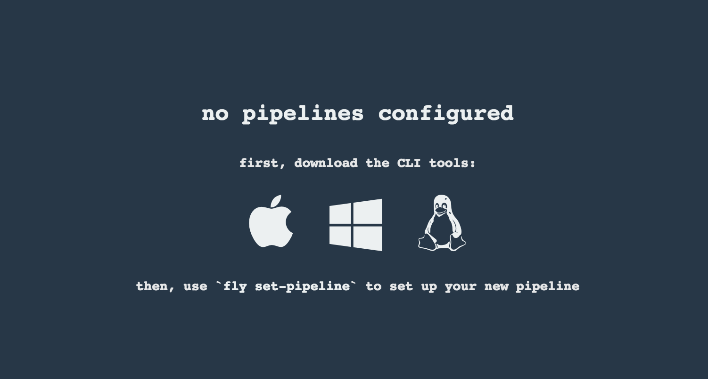
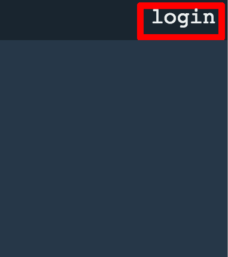
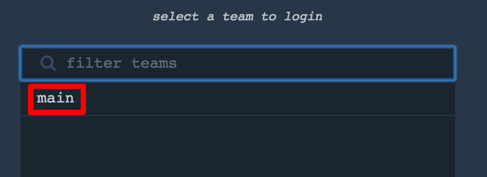
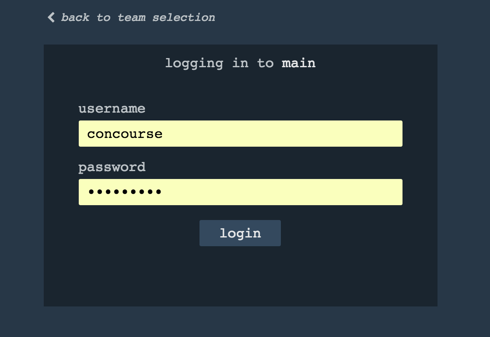
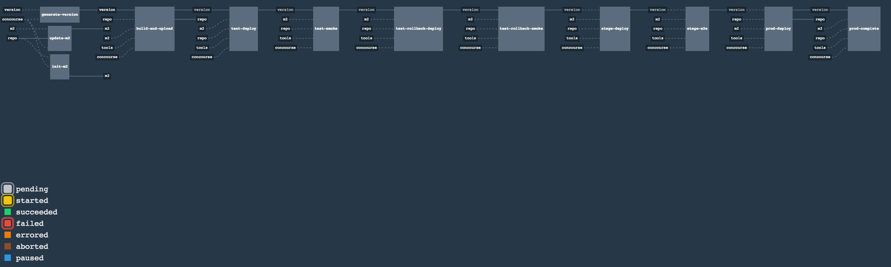
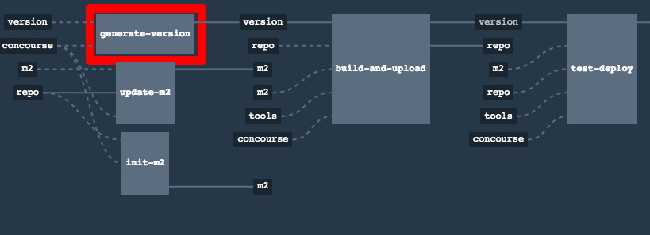
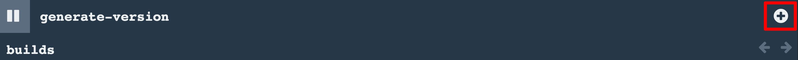
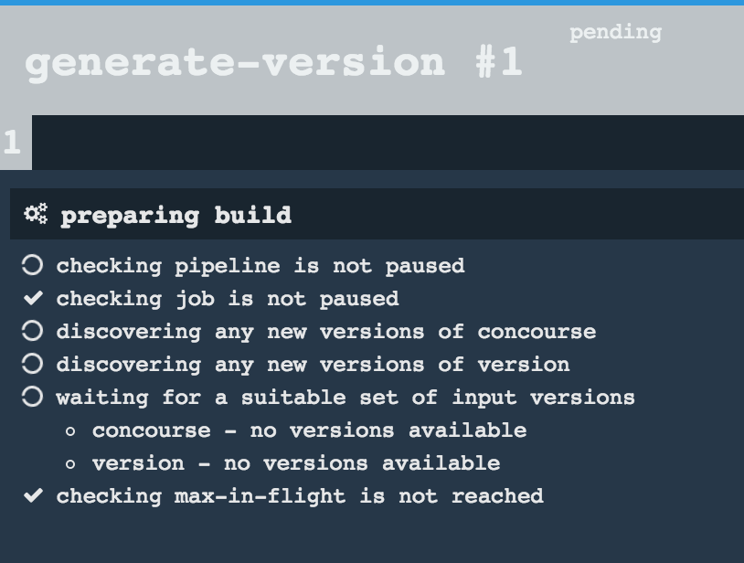
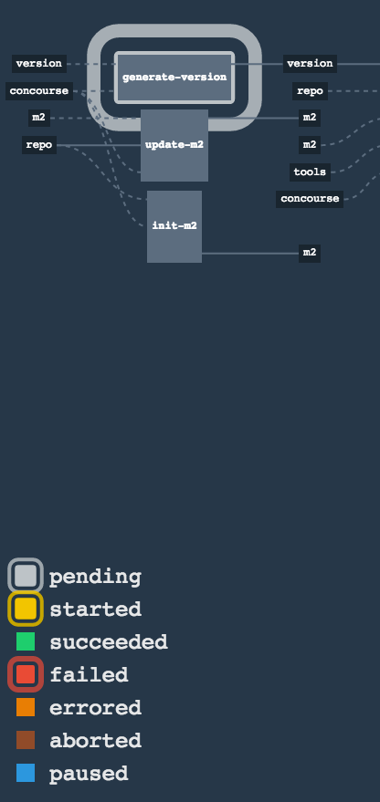

= Concourse Pipeline

The repository contains an opinionated pipeline that will build and deploy  - https://github.com/spring-cloud-samples/github-webhook[Github Webhook] application.

All in all there are the following projects taking part in the whole `microservice setup` for this demo.

- https://github.com/spring-cloud-samples/github-analytics[Github-Analytics] - the app that has a REST endpoint and uses messaging. Our business application.
- https://github.com/spring-cloud-samples/github-webhook[Github Webhook] - project that emits messages that are used by Github Analytics. Our business application.
- https://github.com/spring-cloud-samples/github-eureka[Eureka] - simple Eureka Server. This is an infrastructure application.
- https://github.com/spring-cloud-samples/github-analytics-stub-runner-boot[Github Analytics Stub Runner Boot] - Stub Runner Boot server to be used for tests with Github Analytics. Uses Eureka and Messaging. This is an infrastructure application.

== Step by step

- Fork repos and deploy infra to Artifactory
- Start PCF Dev (if you don't want to use an existing one)
- Start Docker Compose with Concourse + Artifactory
- Setup the `fly` CLI
- Setup your `credentials.yml`
- Run the `github-webhook` pipeline

=== Fork repos and deploy infra to Artifactory

There are 4 apps that are composing the pipeline

  - https://github.com/spring-cloud-samples/github-webhook[Github Webhook]
  - https://github.com/spring-cloud-samples/github-analytics/[Github Analytics]
  - https://github.com/spring-cloud-samples/github-eureka[Github Eureka]
  - https://github.com/spring-cloud-samples/github-analytics-stub-runner-boot[Github Stub Runner Boot]

You need to fork only these. That's because only then will your user be able to tag and push the tag to repo.

  - https://github.com/spring-cloud-samples/github-webhook[Github Webhook]
  - https://github.com/spring-cloud-samples/github-analytics/[Github Analytics]

For the other two

  - https://github.com/spring-cloud-samples/github-eureka[Github Eureka]
  - https://github.com/spring-cloud-samples/github-analytics-stub-runner-boot[Github Stub Runner Boot]

You have to build locally and upload their artifacts to Artifactory.

==== Remove the tags

If you keep playing around with your repo you might end up with some tags that
point to versions that have not been deployed to your Artifactory. That often happens
when you remove the volume that Artifactory is using. To fix this issue just remove
all the tags.

[source,bash]
----
git tag -l | xargs -n 1 git push --delete origin
----

==== Set up your local Maven to work with Artifactory

First, you have to ensure that this section is present under your `~/.m2/settings.xml`

[source,xml]
----
<server>
  <id>artifactory-local</id>
  <username>admin</username>
  <password>password</password>
</server>
----

If you don't have this file just copy paste it from below

[source,xml]
----
<?xml version="1.0" encoding="UTF-8"?>
<settings>
	<servers>
		<server>
			<id>artifactory-local</id>
			<username>admin</username>
			<password>password</password>
		</server>
	</servers>
</settings>
----

==== Deploy the infra JARs to Artifactory

If you're running without Docker Machine

Github Eureka:

[source,bash]
----
git clone https://github.com/spring-cloud-samples/github-eureka
cd github-eureka
./mvnw clean deploy
----

Github Stub Runner:

[source,bash]
----
git clone https://github.com/spring-cloud-samples/github-analytics-stub-runner-boot
cd github-analytics-stub-runner-boot
./mvnw clean deploy
----

If you're running with Docker Machine (e.g. Docker Machine running on 192.168.99.100):

Github Eureka:

[source,bash]
----
git clone https://github.com/spring-cloud-samples/github-eureka
cd github-eureka
./mvnw clean deploy -Ddistribution.management.release.url=http://192.168.99.100:8081/artifactory/libs-release-local
----

Github Stub Runner:

[source,bash]
----
git clone https://github.com/spring-cloud-samples/github-analytics-stub-runner-boot
cd github-analytics-stub-runner-boot
./mvnw clean deploy -Ddistribution.management.release.url=http://192.168.99.100:8081/artifactory/libs-release-local
----

=== Start PCF Dev

TIP: You can skip this step if you have CF installed already

You have to download and start PCF Dev. https://pivotal.io/platform/pcf-tutorials/getting-started-with-pivotal-cloud-foundry-dev/install-pcf-dev[A link how to do it is available here.]

The default credentials when using PCF Dev are:

[source,bash]
----
username: user
password: pass
email: user
org: pcfdev-org
space: pcfdev-space
api: api.local.pcfdev.io
----

You can start the PCF dev with more memory

[source,bash]
----
cf dev start
----

You'll have to create 3 separate spaces (email admin, pass admin)

[source,bash]
----
cf login -a https://api.local.pcfdev.io --skip-ssl-validation -u admin -p admin -o pcfdev-org

cf create-space pcfdev-test
cf set-space-role user pcfdev-org pcfdev-test SpaceDeveloper
cf create-space pcfdev-stage
cf set-space-role user pcfdev-org pcfdev-stage SpaceDeveloper
cf create-space pcfdev-prod
cf set-space-role user pcfdev-org pcfdev-prod SpaceDeveloper
----

IMPORTANT: Most likely you will run out of memory so when reaching the stage
environment it's good to kill all apps on test. You can do it like this:

E.g. for `github-webhook` app

[source,bash]
----
cf target -o pcfdev-org -s pcfdev-test
cf stop github-webhook
cf stop github-eureka
cf stop stubrunner
----

=== Start Docker Compose

Concourse + Artifactory can be ran locally. First we need to set it up - execute:

`./setup-docker-compose.sh`

Next just run
  - `./start.sh` if you don't have Docker Machine
  - `./start.sh 192.168.99.100` if your Docker Machine is running on `192.168.99.100`

Then Concourse will be running on port `8080` and Artifactory `8081`.

=== Setup the `fly` CLI

If you go to Concourse website you should see sth like this:

{nbsp}
{nbsp}

{nbsp}
{nbsp}

You can click one of the icons (depending on your OS) to download `fly`, which is the Concourse CLI. Once you've downloaded that (and maybe added to your PATH) you can run:

[source,bash]
----
fly --version
----

If `fly` is properly installed then it should print out the version.

=== Setup your `credentials.yml`

The repo comes with `credentials-sample.yml` which is set up with sample data (most credentials) are set to be applicable for PCF Dev. Copy this file to a new file `credentials.yml` (the file is added to .gitignore so don't worry that you'll push it with your passwords) and edit it as you wish. For our demo jus setup:

  - `app-url` - url pointing to your forked `github-webhook` repo
  - `github-private-key` - your private key to clone / tag GitHub repos

Below you can see what environment variables are required by the scripts. To the right hand side you can see the default values for PCF Dev that we set in the `credentials-sample.yml`.

[frame="topbot",options="header,footer"]
|======================
|Property Name  | Property Description | Default value
|CF_TEST_API_URL | The URL to the CF Api for TEST env| api.local.pcfdev.io
|CF_STAGE_API_URL | The URL to the CF Api for STAGE env | api.local.pcfdev.io
|CF_PROD_API_URL | The URL to the CF Api for PROD env | api.local.pcfdev.io
|CF_TEST_ORG    | Name of the org for the test env | pcfdev-org
|CF_TEST_SPACE  | Name of the space for the test env | pcfdev-space
|CF_STAGE_ORG   | Name of the org for the stage env | pcfdev-org
|CF_STAGE_SPACE | Name of the space for the stage env | pcfdev-space
|CF_PROD_ORG   | Name of the org for the prod env | pcfdev-org
|CF_PROD_SPACE | Name of the space for the prod env | pcfdev-space
|REPO_WITH_JARS | URL to repo with the deployed jars | http://artifactory:8081/artifactory/libs-release-local
|M2_SETTINGS_REPO_ID | The id of server from Maven settings.xml | artifactory-local
|======================

=== Build the pipeline

Log in (e.g. for Concourse running at `192.168.99.100` - if you don't provide any value then `localhos` is assumed). If you execute this script  (it assumes that either `fly` is on your `PATH` or it's in the same folder as the script is):

[source,bash]
----
./login.sh 192.168.99.100
----

Next run the command to create the pipeline.

[source,bash]
----
./set-pipeline.sh
----

Then you'll create a `github-webhook` pipeline under the `docker` alias, using the provided `credentials.yml` file.
You can override these values in exactly that order (e.g. `./set-pipeline.sh some-project another-target some-other-credentials.yml`)

=== Run the `github-webhook` pipeline

{nbsp}
{nbsp}

{nbsp}
{nbsp}

{nbsp}
{nbsp}

{nbsp}
{nbsp}

{nbsp}
{nbsp}

{nbsp}
{nbsp}

{nbsp}
{nbsp}

{nbsp}
{nbsp}

== FAQ

=== Can I use the pipeline for some other repos?

Sure! Just change the `app-url` in `credentials.yml`!

=== Will this work for ANY project out of the box?

Not really. This is an `opinionated pipeline` that's why we took some
opinionated decisions like:

- usage of Spring Cloud, Spring Cloud Contract Stub Runner and Spring Cloud Eureka
- usage of Maven Wrapper
- artifacts deployment by `./mvnw clean deploy`
- application deployment to Cloud Foundry
- running smoke tests on a deployed app via the `smoke` Maven profile
- running e2e tests on a deployed app via the `e2e` Maven profile

This is the initial approach that can be easily changed in the future.

=== Can I modify this to reuse in my project?

Sure! It's open-source! The important thing is that the core part of the logic is written in Bash scripts. That way, in the majority of cases, you could change only the bash scripts without changing the whole pipeline. https://github.com/marcingrzejszczak/jenkins-pipeline/tree/master/src/main/bash[You can check out the scripts here.]

=== I've ran out of resources!!

When deploying the app to stage or prod you can get an exception `Insufficient resources`. The way to
 solve it is to kill some apps from test / stage env. To achieve that just call

[source,bash]
----
cf target -o pcfdev-org -s pcfdev-test
cf stop github-webhook
cf stop github-eureka
cf stop stubrunner
----

=== The rollback step fails due to missing JAR ?!

You must have pushed some tags and have removed the Artifactory volume that
contained them. To fix this, just remove the tags

[source,bash]
----
git tag -l | xargs -n 1 git push --delete origin
----
